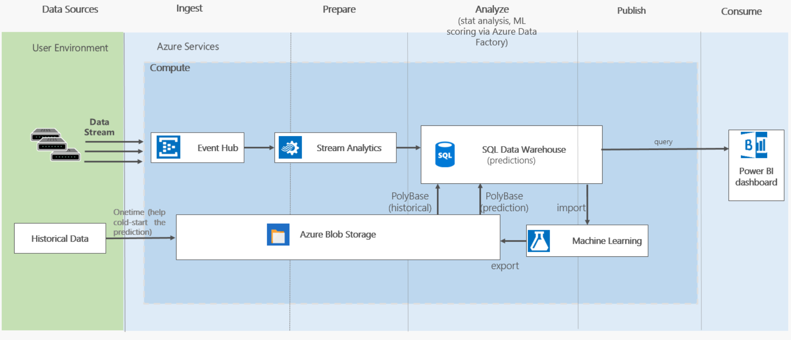

#Cortana Intelligence Suite Retail Customer Churn Solution


## Table of Contents
- [Introduction](#introduction)
- [Prerequisites](#prerequisites)
- [Architecture](#architecture)
- [Setup Steps](#setup-steps)
- [PowerBI Dashboard](#powerbi-dashboard)
- [Retrain](#retrain)


## Introduction

The objective of this tutorial is to demonstrate predictive data pipelines for retailer to predict customer churn.  By combining domain knowledge and predictive analytics, retailers can prevent customer churn by using the predictive result and proper marketing strategies.  It also shows  how retraining of a model works.

The end-to-end solution is implemented in the cloud, using Microsoft Azure. The solution is composed of several Azure components, including data ingest, data storage, data movement, advanced analytics and visualization. The advanced analytics is featured with Azure Machine Learning where you can use Python or R language to  build data science model and also reuse existing in-house or third-party libraries.  With data ingest, the solution can make prediction based on the data that moves in to azure from on-premises environment.

This deployment guide will guide you through the process of creating such a customer churn prediction solution. The tutorial will include:

- The generation and ingestion of purchase transaction data using  Azure Event Hub and Azure Streaming Analytics.
- The creation of an Azure SQL Data Warehouse (DW) to store large amount of transaction records in real time
- Use of PolyBase to load on-premises data to Azure SQL DW
- Using Azure Machine Learning (AML) to deploy prediction model as web services and run periodic prediction in Azure Data Factory (ADF)
- Dashboard to display sales and customer churn data
- Retaining of the machine learning model with new data

## Prerequisites

The steps described later in this guide  require the
following prerequisites:

1)  Azure subscription with login credentials
    (https://azure.microsoft.com/en-us/)

2)  Azure Machine learning Studio subscription
    (https://azure.microsoft.com/en-us/services/machine-learning/)

3)  A Microsoft Power BI account
    (https://powerbi.microsoft.com/en-us/)

4)  Power BI Desktop installation
    (https://powerbi.microsoft.com/en-us/desktop/?gated=0&number=0)

5)  A local installation of <a href="https://azure.microsoft.com/en-us/documentation/articles/sql-data-warehouse-install-visual-studio/">Visual Studio with SQL Server Data Tools (SSDT)</a>


##Architecture


Figure 1 illustrates the Azure architecture developed in this sample.


Figure 1: Architecture

The above figure is the implemented architecture. The historical data as text format will be loaded from Azure Blob Storage into Azure SQL DW though PolyBase.  The real-time event data will be ingested through Event Hub into Azure.  Azure Stream Analytics will store the data in Azure SQL DW. The prediction through AML runs in batch mode and is invoked by Azure Data Factory. AML will import data from Azure SQL DW and output the prediction to Azure Blob Storage. Through PolyBase, the prediction result can be loaded into Azure SQL DW efficiently and fast. Azure SQL DW serves the queries to populate the PowerBI dashboard. We use Azure Data Factory to orchestrate
1) AML prediction
2) Copy the prediction from Azure Blob Storage to  Azure SQL DW.

The machine learning model here is used as an example experiment and it shows the general techniques of data science that can be used in customer churn prediction. You can use domain knowledge and combine the available datasets to build more advanced model to meet your business requirements.

 For the nature of the problem, customer behavior changes slowly and doesn’t require real-time or near real-time prediction in minute scale. Therefore, we use AML in batch mode.  We use Azure SQL DW for its scalability to query large amount of data, and its elasticity of starting small and scaling up as needed easily.  We chose to use PolyBase to load data into Azure SQL DW because of its high efficiency.


##Setup Steps

The following are the steps to deploy the end-to-end solution for the predictive pipelines.

### Instruction for Finding Resource Groups

Going back to your resource group is important over the course of deployment steps. Here is the how we can find the desired resource group:

 1. Log into the Azure Management Portal https://ms.portal.azure.com
 1. Click  **Resource groups** button on upper left
 1. Choose the subscription your resource group resides in
 1. Use keywords to search or directly select your resource group in the list of resource groups
 1. You need to close the resource description page to add new resources


### Unique String

 You will need a unique string to identify your deployment because some Azure services, e.g. Azure Storage requires a unique name for each instance across the service. We suggest you use only letters and numbers in this string and the length should not be greater than 9.
 We suggest you use "[UI]churn[N]"  where [UI] is the user's initials,  N is a random integer that you choose and characters must be entered in in lowercase. Please open your memo file and write down "unique:[unique]" with "[unique]" replaced with your actual unique string.

### Create an Azure Resource Group

1. Log into the Azure Management Portal https://ms.portal.azure.com
1. Click  **Resource groups** button on upper left, and then click **+** to add a resource group.
1. Enter your **unique string** for the resource group and choose your subscription.
1. For **Resource Group Location**, you should choose one of the following as they are the locations that support all the Azure services used in this guide:
  - South Central US
  - West Europe
  - Southeast Asia


Please open your memo file and save the information in the form of the following table. Please replace the content in [] with its actual value.  

| **Azure Resource Group** |                     |
|------------------------|---------------------|
| resource group name    |[unique]|
| region              |[region]||

In the following steps, if any entry or item is not mentioned in the instruction, please leave it as the default value.

### Create Azure Storage Account

1. Go to Azure Portal https://ms.portal.azure.com and choose the resource group you just deployed
2. In ***Overview*** panel, click **+** and enter **storage account** and hit "Enter" key to search
3. Click **Storage account** offered by Microsoft in "Storage" category
4. Click **Create** at the bottom of the description panel
5. Enter your **unique string** for "Name".
6. Make sure the selected resource group is the one you just created. If not, choose the resource group you created for this solution.
7. Leave everything else to use the default value
8. Click **Create** at the bottom. The portal may lead you back to the storage account description panel. Close the panel and DO NOT click "Create".
9. Go back to your resource group overview and wait until the storage account is created. To check if the resource is created or not, refresh the page or the list of the resources in the resource group as needed.

#### Get the Primary Key of Azure Storage Account
These are the steps to get the access key that will be used in the SQL script to load the data into Azure SQL DW:

1. Click the created storage account and in the new panel click **Access keys**
1. In the new panel, click the icon of "Click to copy" and paste the key in your memo

| **Azure Storage Account** |                     |
|------------------------|---------------------|
| Storage Account        |[unique string]|
| access key     |[key]             ||

#### Create Containers and Upload Data to Azure Storage Account
These are the steps for creating containers and uploading the data to Azure blob storage:

1. Click **Containers** and on the new panel click **+** to add a containers
1. Enter **data** for "Name" and click **Create** at the bottom
1. Click the **data** container -> click "Upload" button on the top of the new panel
1. Choose [Users.csv](resource/Users.csv) file that you can download from "resource" folder
1. Click **Upload**
1. Repeat the last two steps for [Actvities.csv](resource/Actvities.csv), [age.csv](resource/age.csv), [region.csv](resource/region.csv).


### Create Azure SQL Data Warehouse
1. Go to Azure Portal https://ms.portal.azure.com and choose the resource group you just deployed
2. In ***Overview*** panel, click **+** and enter **SQL Data Warehouse** and hit "Enter" key to search
3. Click **SQL Data Warehouse** offered by Microsoft in "Databases" category
4. Click **Create** at the bottom of the description panel
5. Enter your **unique string** for "Database Name"
6. Make sure the selected resource group is the one you just created. If not, choose the resource group you created for this solution.
7. Leave **Select source** as the default value "Blank database"
7. Click **Server**. In the new panel, click  **Create a new server**
8. In the new panel for "New Server"
    1. Enter **unique string** for "Server name"
    2. Use **azureadmin** or any of your preferred admin name. Please write it down in your memo: [User]:[the value you entered]
    3. Use **pass@word1**  or any of your preferred password. Please write it down in your memo: [Password]:[the value you entered]
    4. Click **Create**
8. Adjust Performance to **300** DWU by dragging the sliding bar to the left. See  [Manage compute power in Azure SQL Data Warehouse (Overview)](https://docs.microsoft.com/en-us/azure/sql-data-warehouse/sql-data-warehouse-manage-compute-overview) for more information about DWU.
9. Click **Create** at the bottom. The portal may lead you back to the SQL Data Warehouse description panel. Close the panel and DO NOT click "Create".
9. Go back to your resource group overview and wait until the resource is created.  To check if the resource is created or not, refresh the page or the list of the resources in the resource group as needed.
10. In the list of resources, click on the SQL Server that was just created.
11. Under ***Settings*** for the new server, click ***Firewall*** and create a rule called ***open*** with the IP range of **0.0.0.0** to **255.255.255.255**. This will allow you to access the database from your desktop. Click ***Save*** at the top of the panel.

    **[Note]: This firewall rule is not recommended for production level systems but for this demo it is acceptable. You will want to change this rule to only allow the IPs with trust.**

| **Azure SQL Data Warehouse** |                     |
|------------------------|---------------------|
| Server Name            |[unique string].database.windows.net|
| Database               |[unique string]|
| User     |                     |
| Password               |                     ||


### Load Historical Data into Azure SQL Data Warehouse
1. Open the [createTableAndLoadData.dsql](resource/createTableAndLoadData.dsql) in the resources in Visual Studio 2015 with SQL Server Data Tools (SSDT)
2. Click the green button on the top-left core of the file window.  
3. Input the corresponding info for this solution. Choose **SQL Server Authentication** for **Authentication**. Choose the database with name of the unique string you specified earlier.
4. Wait until all the queries finishes.


### Set up Azure Machine Learning

#### Create Azure Machine Learning Workspace

1. Go to Azure Portal https://ms.portal.azure.com and choose the resource group you just deployed
2. In ***Overview*** panel, click **+** and enter **Machine Learning Workspace** and hit "Enter" key to search
3. Click **Machine Learning Workspace** offered by Microsoft in "Intelligence + analytics" category
4. Click **Create** at the bottom of the description panel
5. In the Machine Learning workspace panel,
    1. Enter your **unique string** for "Workspace name"
    2. Leave "subscription", "Resource group", and "Location" as the default
    3. Choose **Use existing** for "Storage account" and select your unique string as the storage account.  
    4. Choose **standard** for "Workspace pricing tier"
    5. Choose **Create new** for "Web service plan"
    6. Click on **Web service plan tier**, choose **S1 Standard** and click **Select** at the bottom
    7. Click **Create** at the bottom

#### Deploy Azure Machine Learning Predictive Web Service
1. Go to
https://gallery.cortanaintelligence.com/Experiment/Retail-Churn-Predictive-Exp-1
2. Click **Open in Studio** on the right. Login as needed.
3. Choose the region and workspace. For region, you should choose the region that your resource group resides. You can get the information from table "Azure Resource Group".  For workspace, you should choose the workspace with the name the same as your unique string.
4. Wait until the experiment is copied
5. Input database information in the two **Import Data** modules at the top of the experiment. Select the module to change its parameters. You only need to change **Database server name**,**Database name**, **User name** and **Password**. Use the information you collected in the table  "Azure SQL Data Warehouse". Leave the query as it is
6. Click **Run** at the bottom of the page. It takes around three minutes to run the experiment.
7. Click **Deploy Web Service**  at the bottom of the page,  choose **classic** web service, and click "Yes" to publish the web service. This will lead you to the web service page.  The web service home page can also be found by clicking the ***WEB SERVICES*** button on the left menu once you log in your workspace.
8.  Copy the ***API key*** from the web service home page and save it to your memo
9. Click the link ***BATCH EXECUTION*** under the ***API HELP PAGE*** section. On the BATCH EXECUTION help page, copy the
***Request URI*** under the ***Request*** section and add it to the table below as you will need this information later
. Copy only the URI part https:… /jobs, ignoring the URI parameters starting with "?". Here is an example of what is should look like: https://ussouthcentral.services.azureml.net/workspaces/xxxx/services/xxxx/jobs

|**Machine learning Web Service** |      |
| --------------------------- |--------------------------:|
| apiKey                     | [API key from API help page]|
| mlEndpint              |        [Batch Request URI]                   ||

### Create an Azure Event Hub
1. Go to Azure Portal https://ms.portal.azure.com and choose the resource group you just deployed
2. In "Overview" panel, click **+** and enter **Event Hubs** and hit "Enter" key to search
3. Click **Event Hubs** offered by Microsoft in "Internet of Things" category
4. Click **Create** at the bottom of the description panel
5. In the new panel of "create namespace":
  1. Enter your **unique string** for "Name"
  2. Leave everything else as default
6. Go back to your resource group overview
7. Look into the ***Type*** and choose the one with type ***Event hubs***. Select the service bus namespace created through the previous steps. If the resource is not listed, wait until the resource is created.
8. On the new expanded panel, click ***Event Hubs*** in the ***Entities*** listing.
9. Click **+** to add an event hub
10. In the new panel:
    1. Enter **churn** for "Name"
    2. Enter **4** for "Partition Count"
    3. Enter **2** for "Message Retention"
    4. Click **Create** at the bottom
11. Go back to your resource group and look into the ***Type*** and choose the one with type ***Event hubs***. Select the service bus namespace created through the previous steps.
On the new expanded panel, click ***Event Hubs*** in the ***Entities*** listing.
12. Click event hub **churn** created through the previous steps. In the new panel
    1. Click ***Shared access policies*** in the ***SETTING*** listing
    2. In the new panel,  click **+** to add a new policy. In the new panel
        1. Enter **sendreceive** for the "Policy name"
        2. Check **Send** and **Listen**
        3. Click **Create** at the bottom of the panel
        4. Wait until the new policy is created and shown in the listing of "Shared access policies"
        5. Click the policy **sendreceive**, and save "PRIMARY KEY"  to your memo

| **Azure Event Hub** |                        |
|---------------------|------------------------|
| EventHubServiceNamespace | [unique string]  |
| Event Hub           |  churn           |
| EventHubServicePolicy  |     sendreceive                 |
| EventHubServiceKey       |  [PrimaryKey]     ||


### Create an Azure Stream Analytics Job
1. Go to Azure Portal https://ms.portal.azure.com and choose the resource group you just deployed
2. In ***Overview*** panel, click **+** and enter **Stream Analytics job** and hit "Enter" key to search
3. Click **Stream Analytics job** offered by Microsoft in "Internet of Things" category
4. Click **Create** at the bottom of the description panel
5. Enter your **unique string** in the "Job name"
6. Click **Create** at the bottom
7. Go back to your resource group and refresh the listing
8. Click your **unique string** with the type "Stream Analytics job"
9. In the new panel, click **Inputs** and click **+** in the new panel. In the "New input" panel:
    1. Enter  **datagen** for  "Input alias"
    2. Choose **Data Stream** for "Source type"
    3. Choose **Event hub** for "Source"
    4. Leave subscription to the default
    5. Choose your **unique string** for the "Service bus namespace"
    6. Choose **churn** for "Event hub name"
    7. Choose **sendreceive** as "Event hub policy name"
    8. Level everything else as default and click **Create** at the bottom
10. In the new panel, click **Outputs** and click **+** in the new panel. In the "New output" panel:
    1. Enter  **sqldw** for "Output alias"
    2. Choose **SQL database** for  "Sink"
    3. Leave subscription to the default
    4. choose your **unique string** for the "Database"
    5. Enter your username and password for the database
    6. Enter **Activities** for "Table" and  click **Create** at the bottom
11. In the new panel, click **Query** and click **+** in the new panel. In the new panel, remove the default content and  enter
```
SELECT
System.Timestamp systime,
TransactionId,
"Timestamp",
UserId,
ItemId,
Quantity,
Value,
ProductCategory,
Location
INTO
    sqldw
FROM datagen;
```
  Click the **save** icon to save the query.
  **[Note]: The input alias and output alias are used in the query, and the selected column should have name or alias exactly the same as in Activities table.**

12. Go back to the overview of the Stream analytics job, click **start** to start the Stream Analytics job. In the new panel, choose "Now" for the "Job output starttime" and click **Start** at the bottom.  

### Set up Azure Web Job/Data Generator

The data generator emits one day's transaction data every 15 minutes to reduce the wait time to see the final results.

1. Go to Azure Portal https://ms.portal.azure.com and choose the resource group you just deployed
2. In ***Overview*** panel, click **+** and enter **Web App** and hit "Enter" key to search
3. Click **Web App** offered by Microsoft in "Web + Mobile" category
4. Click **Create** at the bottom of the description panel
5. In the new panel,
    1. Enter your **unique string** for "App name"
    2. Leave "subscription" and "Resource group" as the default
    3. Click **App Service Plan/Location** and in the new panel of ***App Service Plan***
        1. Click **Create New** and enter your unique string for the ***App Service Plan*** in the new panel
        2. Choose the region where your resource group resides
        3. Click **OK** at the bottom of the panel
6. Click **Create** at the bottom
7. Go back to your resource group until the Web App is created. You can check the notification. It takes around two minutes to create the web app.
8. Refresh the resource listing in your resource group and select the web Service
8. On the side panel, search "Application Settings" and click ***Application Settings*** and on the new panel
    1. Choose **2.7** for the Python version
    2. Choose **64-bit** for the Platform
    3. Toggle **On** for "Always on"
    4. In the ***App Setting***, add the following key-value pairs:

      | **Azure App Service Settings** |             |
      |------------------------|---------------------|
      | Key                    | Value               |
      | EventHubServiceNamespace |[unique string]          |
      | EventHub              |churn         |
      | EventHubServicePolicy              |sendreceive         |
      |    EventHubServiceKey           |[unique string]            ||

  Click **save** and close the panel

9. On the side panel, search "WebJobs" and click **WebJobs**
10. Click **+** and in the new panel
    1. Enter **eventhub15min** for "Name". Space character is not allowed in the name.
    2. Select the downloaded [eventhub_15min.zip](resource/eventhub_15min.zip) for "File Upload". Click "Raw" on the github page to download the zip file.
    3. Choose **Triggered** for Type
    4. Choose **Manual** for "Trigger"  (Note: because the zip file has the scheduled setting file, we can use manual in this step for scheduled jobs)
    5. Click **OK** at the bottom

11. Select the job "eventhub15min" and **start** it. Wait until the job finishes.


### Check Data Ingest

you can check if the data is ingested into your data warehouse by using Visual Studio 2015 with SSDT to run testing queries.

1. Open Visual Studio 2015 with SSDT
2. Click "View" in the menu
3. Choose "SQL Server Object Explorer"
4. Click "Add" icon to add the SQL server that's created in this solution
5. Filling info on the dialogue as needed. Choose "SQL Server Authentication" for ***Authentication***
6. After connecting to the server, expand the server,  in "Databases", choose the database you create in this solution, which has the same name as the unique string.
6. Right click on the database, choose "New query"
7. Run this query
```
select top 1 * from Activities order by timestamp desc
```
Compare the value in the "SysTime" with the current UTC time.  The difference should be no more than 15 minutes.

### Set up Azure Data Factory
1. Go to Azure Portal https://ms.portal.azure.com and choose the resource group you just deployed
2. In ***Overview*** panel, click **+** and enter **Data Factory** and hit "Enter" key to search
3. Click **Data Factory** offered by Microsoft in "VM Extension" category
4. Click **Create** at the bottom of the description panel
5. In the new panel of "New data factory",
    1. Enter your **unique string** for "Name"
    2. Click **Create** at the bottom
6. Go back to your resource group and select the data factory that's created through previous steps
7. Click ***Author and deploy*** on the new panel
8. Create Linked services:
    1. Click **New Data Store**, choose ***Azure Storage***, replace the content in the editor with the content in [AzureStorageLinkedService.json](resource/AzureDataFactory/AzureStorageLinkedService.json) to the editor, replace "[unique]" with your unique string and "[Key]" with your storage key, and click the upper arrow button to  deploy it
    2. Click **New Data Store**, choose ***Azure SQL Data Warehouse***, replace the content in the editor with    the content in [AzureSqlDWLinkedService.json](resource/AzureDataFactory/AzureSqlDWLinkedService.json) to the editor, replace "[unique]" with your unique string  and  "[User]" and "[password]" with their real value in this solution, and click the upper arrow button to  deploy it. Note that there are two instances of "[unique]".
    3.  Click **New Compute**, choose ***Azure ML***,  replace the content in the editor with  the content in [AzureMLLinkedService.json](resource/AzureDataFactory/AzureMLLinkedService.json) to the editor, replace  the content in "mlEndpoint" and "apikey" with  the real value in this solution, and click the upper arrow button to  deploy it. You can check the value from your memo in the Azure Machine learning Web service part.
9. Create datasets
    1. Click **New Dataset**, choose ***Azure Blob Storage***, replace the content in the editor with the content in [AzureBlobDataset.json](resource/AzureDataFactory/AzureBlobDataset.json) to the editor, and click the upper arrow button to  deploy it
    1. Click **New Dataset**, choose ***Azure SQL Data Warehouse***, replace the content in the editor with the content in [AzureSqlDWInputUser.json](resource/AzureDataFactory/AzureSqlDWInputUser.json) to the editor, and click the upper arrow button to  deploy it
    1. Click **New Dataset**, choose ***Azure SQL Data Warehouse***, replace the content in the editor with  the content in [AzureSqlDWInputActivity.json](resource/AzureDataFactory/AzureSqlDWInputActivity.json) to the editor, and click the upper arrow button to  deploy it
    1. Click **New Dataset**, choose ***Azure SQL Data Warehouse***, replace the content in the editor with  the content  in [AzureSqlDWOutputPrediction.json](resource/AzureDataFactory/AzureSqlDWOutputPrediction.json) to the editor, and click the upper arrow button to  deploy it
10. Create pipelines
    1. Right click **Drafts**, choose "New pipeline",
        1. Copy the content in [MLPipeline.json](resource/AzureDataFactory/MLPipeline.json) to the editor,
        2. Replace "[unique]" with your unique string  and  "[User]" and "[password]" with their real value in this solution
        3. Specify an active period that you want the pipeline to run.  Since the data passing through in 15 minutes represents a day's data, and we have 60 days data in total, we needed only 15-hour period for the pipeline. You should use the current UTC time as the starttime. An example is like:
        ```
        "start": "2016-12-01T00:00:00Z",
        "end": "2016-12-01T15:00:00Z",
        ```
        4.  start the pipeline by setting the value "isPaused" to "false"
        ```
        "isPaused": false
        ```
        4.  click the upper arrow button to  deploy it

    2. Right click **Drafts**, choose "New pipeline",
        1. Copy the content in [BlobToSqlDW.json](resource/AzureDataFactory/BlobToSqlDW.json) to the editor,
        2. Specify an active period that you want the pipeline to run. It should be the same as the MLPipeline
        4.  start the pipeline by setting the value "isPaused" to "false"
        ```
        "isPaused": false
        ```
        3. Click the upper arrow button to  deploy it


## PowerBI Dashboard

1. Download the Power BI Desktop application (https://powerbi.microsoft.com/en-us/desktop)
2. Download the Power BI template file dashboard.pbix (Click Raw to start downloading) 3. and open it with Power BI application
3. On the application ribbon menu, choose Edit Queries
4. Go to Query Settings on the right panel, double click Source
5. In the SQL Server Database dialog
    1. Type: Server Name: [unique].database.windows.net
    1. Type: Database Name: [unique]
    1. Click: OK
    1. Choose: Database for Authentication method
    1. Input:  [user] and [password]
    1. On the application ribbon menu, click "Close and Apply"
6. Once data is loaded, On the application ribbon menu, click "Publish"
7. When prompt with dialog windows, click "Save"

If you reach here, you have a working solution that runs the customer churn prediction. Over the time, you might have accumulate customer transaction data that display a different buying behavior and therefore you need to retrain your model. The following steps show you how to set up a retrain pipeline which updates the model with new data every 1 hour.

## Retain

### Deploy Training Machine Learning Web Service
1. Go to https://gallery.cortanaintelligence.com/Experiment/Retail-Churn-Train-1
2. Click ***Open in Studio*** on the right. Login as needed.
3. Choose the region and workspace. For region, you should choose the region that your resource group resides. For workspace, you should choose the workspace with the name the same as your unique string.
4. Wait until the experiment is copied
5. Input database information in the two **Import Data** modules. You only need to change "Database server name", "Database name", "User name" and "Password". Use the information you collected in the "Azure SQL Data Warehouse" table. Leave the query as it is.
6. Click **Run** at the bottom of the page. It takes around three minutes to run the experiment.
7. Click **Deploy Web Service** at the bottom of the page, choose classic web service, and click "Yes" to publish the web service. This will lead you to the web service page. The web service home page can also be found by clicking the WEB SERVICES button on the left menu once logged in your workspace.
8. Copy the API key from the web service home page and save it to your memo
9. Click the link ***BATCH EXECUTION*** under the ***API HELP PAGE section***. On the BATCH EXECUTION help page, copy the Request URI under the Request section and add it to the table below as you will need this information later . Copy only the URI part https:… /jobs, ignoring the URI parameters starting with ? .

  | **Train Machine learning Web Service** |                           |
  | --------------------------- |--------------------------|
  | apiKey                     | [API key from API help page]|
  | mlEndpint              |        [Batch Request URI]                   ||


### Create Updatable Predictive Machine Learning Web Service
The default web service endpoint we deployed in the section of "Deploy Azure Machine Learning Predictive Web Service" is associated with the experiment itself. In order to have a updatable endpoint, we need to create an additional service endpoint.

1. Go to https://studio.azureml.net, and choose workspace with the name of your unique string. You can change the workspace by clicking drop-down list on the top right of the web page.
2. On the left side, choose **Web Service** and click the service that you deployed in the section "Deploy Azure Machine Learning Predictive Web Service" with name "Retail Churn [Predictive Exp.]"
3. Click ***Manage endpoints*** at the bottom of the page in the "Additional endpoints" section.
4. On the newly loaded page, click **+New**,
    1. Enter **update** for "Name"
    2. Leave everything else as default
    3. Click **Save**
5. After the endpoint is created, click the "update" service endpoint
    1. click ***Use endpoint*** under the **BASICS** picture, save to the memo the "**Primary key**", "**Batch requests**" (only need to copy up to "jobs") and also "**Patch**"
    2. Click ***API help*** under ***Patch*** URI, in the new page, save to the memo the **Resource Name** in the ***Updatable Resources*** section. It starts with "Retail Churn Template". This will be used in Azure Data Factory pipeline to update the model. An example can be found in ([AzureMLLinkedService.json](resource/AzureDataFactoryRetrain/AzureMLLinkedService.json)).

    | **Updatable Predictive Machine Learning Web Service** |                           |
    | --------------------------- |--------------------------:|
    | apiKey                     | [Primary Key]|
    | mlEndpint              |        [Batch Request URI]                   |
    | updateResourceEndpoint |   [Patch URI]|
    | trainedModelName | [Resource Name]|

### Create Azure Data Factory For Retraining and Updating
1. Go to Azure Portal https://ms.portal.azure.com and choose the resource group you just deployed
2. Click the data factory you created in this solution
3. Click ***Author and deploy***
3. Stop MLPipeline:
    1.  Click **MLPipeline** in the "Pipelines" list,
    2.  Start the pipeline by setting the value "isPaused" to "true"
    ```
    "isPaused": true
    ```
    3.  Click the upper arrow button to  deploy it
4. Create/Update Linked services:
    1. Click **New Compute**, choose ***Azure ML***,  replay the content in the editor with  the content in [AzureMLLinkedServiceTraining.json](resource/AzureDataFactoryRetrain/AzureMLLinkedServiceTraining.json), replace  the content in "mlEndpoint" and "apikey" with  the real value in the "Train Machine learning Web Service" section of your memo , and click the upper arrow button to  deploy it. You can check the value from your memo in the Azure Machine learning Web service part.
    2. Click **AzureMLLinkedService**, remove the content in the editor, copy  the content in [AzureMLLinkedService.json](resource/AzureDataFactoryRetrain/AzureMLLinkedService.json) in the retrain folder  to the editor, replace  the content in "mlEndpoint" , "apikey" and "updateResourceEndpoint" with  the real value in the "Updatable Predictive Machine learning Web Service" section of your memo , and click the upper arrow button to  deploy it.
5. Create datasets
    1.  Click **New Dataset**, choose ***Azure Blob Storage***, replace the content in the editor with the content in [TrainedModelBlob.json](resource/AzureDataFactoryRetrain/TrainedModelBlob.json) to the editor, and click the upper arrow button to  deploy it
    1.  Click **New Dataset**, choose ***Azure SQL Data Warehouse***, replace the content in the editor with the content in [AzureSqlDWInputUserRetrain.json](resource/AzureDataFactoryRetrain/AzureSqlDWInputUserRetrain.json) to the editor, and click the upper arrow button to  deploy it
    1. Click **New Dataset**, choose ***Azure SQL Data Warehouse***, replace the content in [AzureSqlDWInputActivityRetain.json](resource/AzureDataFactoryRetrain/AzureSqlDWInputActivityRetrain.json) to the editor, and click the upper arrow button to  deploy it
    1. Click **New Dataset**, choose ***Azure Blob Storage***, replace the content in the editor with the content in [PlaceHolderRetrain.json](resource/AzureDataFactoryRetrain/PlaceHolderRetrain.json) to the editor, and click the upper arrow button to deploy it
6. Create pipelines
    1. Right click **Drafts**, choose "New pipeline",
        1. Copy the content in [RetrainPipeline.json](resource/AzureDataFactoryRetrain/RetrainPipeline.json) to the editor,
        2. Replace "[unique]" with your unique string (two instances of ""[unique]""),  "[User]" and "[password]" with their real value in this solution
        3. Specify an active period that you want the pipeline to run.  Since the data passing through in 15 minutes represents a day's data, and  we have 60 days data in total, we needed only 15-hour period for the pipeline. You should use the current UTC time as the starttime. An example is like:
        ```
        "start": "2016-12-01T00:00:00Z",
        "end": "2016-12-01T15:00:00Z",
        ```
        4.  Start the pipeline by setting the value "isPaused" to "false"
        ```
        "isPaused": false
        ```
        4.  Click the upper arrow button to  deploy it

    2. Right click **Drafts**, choose "New pipeline",
        1. Copy the content in [UpdatePipeline.json](resource/AzureDataFactoryRetrain/UpdatePipeline.json) to the editor,
        2. Specify an active period that you want the pipeline to run. It should be the same as the RetrainPipeline.
        3.  Start the pipeline by setting the value "isPaused" to "false"
        ```
        "isPaused": false
        ```
        4. Click the upper arrow button to  deploy it
7. Start MLPipeline
    1.  Click **MLPipeline** in the "Piepelines" list,
    2.  Start the pipeline by setting the value "isPaused" to "false"
        ```
        "isPaused": false
        ```
    3.  Click the upper arrow button to  deploy it

To get more information about retrainng, please go to [Updating models using Update Resource Activity](https://docs.microsoft.com/en-us/azure/data-factory/data-factory-azure-ml-batch-execution-activity#updating-models-using-update-resource-activity).
